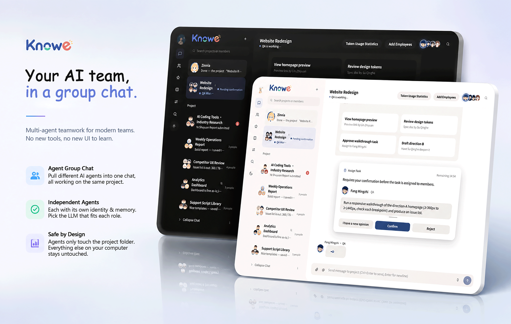

  

# Knowe — 用群聊的方式，指挥你的 Agent 团队

[简体中文](README.zh-CN.md) | [English](README.md)

Knowe 用你最熟悉的聊天软件界面，把 Agent 变成一支团队。你可以给每个项目建立自己的专属群聊、定制专属 Agent 团队。

---

## 组建你的 Agent 团队

把不同的 Agent 拉进同一个群聊，共同为一个项目服务。团队按项目组织，每个项目都有自己的专属群。

  <video src="https://github.com/user-attachments/assets/4c223c55-42f4-4c47-9c36-c14676afff50" width="80%" controls autoplay loop muted playsinline></video>

## 定制你的团队成员

每个 Agent 都是独立的实例——身份与记忆独立，可根据需求自由选配大模型服务。给不同的成员换上不同的「大脑」，让擅长的事交给擅长的成员。

  <video src="https://github.com/user-attachments/assets/994cc11b-793e-4ae8-ae65-4850bf257143" width="80%" controls autoplay loop muted playsinline></video>

## 一句话派活，团队自动干活

你不需要学习怎么写提示词、怎么拆任务。项目经理（Coordinator）会自动把任务拆成小任务，分派给合适的员工（Worker）执行，并把结果汇总给你。需要你决定的事，会弹卡问你，你点一下就行。

  <video src="https://github.com/user-attachments/assets/e73a3a42-1089-47bc-a584-92939b9b1dee" width="80%" controls autoplay loop muted playsinline></video>

## 还有这些

- **记忆与知识库**：友好的聊天记录、收藏、知识库功能，可跨群聊转发消息、项目内经验共享。
- **安全边界**：Agent 文件工具限定在项目工作区；模型生成的进程运行于无网络的操作系统沙箱。无法建立隔离时终端会直接禁用，只有你明确批准的文件能跨过工作区边界。

---

## 快速上手

1. 前往 [Releases](https://github.com/HirezmingD/Knowe-agent-groupchat/releases) 下载最新安装包
2. 安装并打开 Knowe，配置你的模型服务（API Key）
3. 创建项目群聊，开始组建你的 Agent 团队

## 了解更多

- 📄 快速技术文档 [TECH.md](./TECH.md) · [简体中文版](./TECH.zh-CN.md)
- 📚 完整用户手册 [Docs 简体中文](./docs/CN/00-概述.md) · [Docs English](./docs/EN/00-Overview.md)

## License

本项目采用 [MIT](./LICENSE) 协议。

---

*Knowe 是 AI 辅助工具，使用过程中产生的数据与结果由使用者自行负责。*
