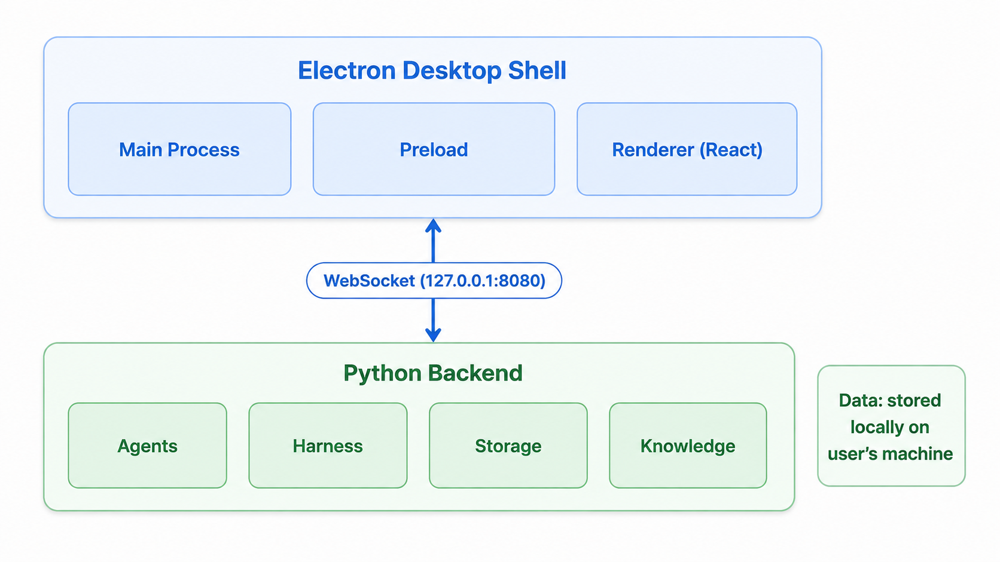
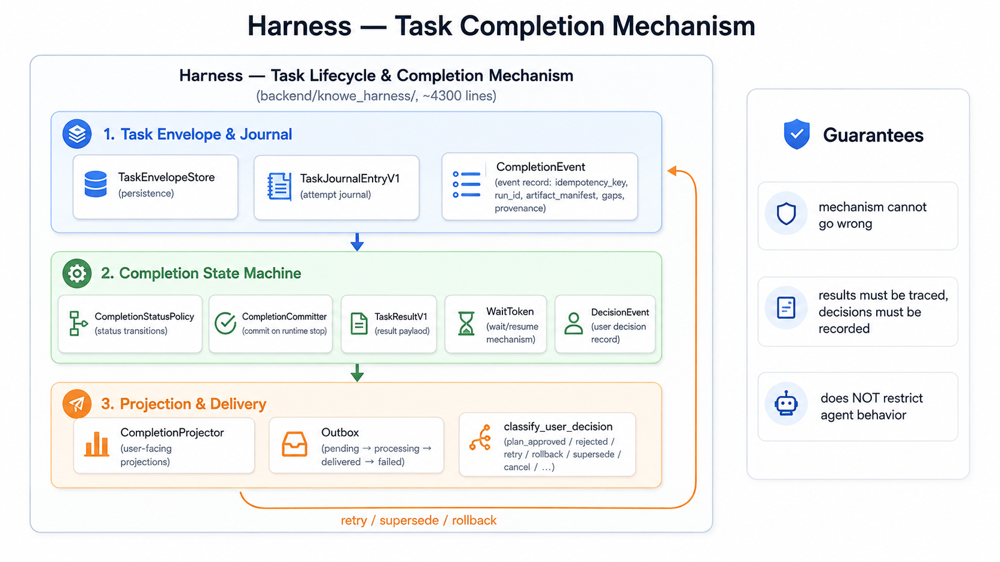

# Knowe — Technical Overview

A quick technical guide for developers who want to run, build, or extend Knowe. For the full user manual, see [docs](./docs/EN/00-Overview.md) (中文见 [docs/CN](./docs/CN/00-概述.md)).

---

## Architecture at a glance



- **Frontend**: Electron + React 18 + TypeScript, built with electron-vite
- **Backend**: Python 3.11 (FastAPI-style async server), packaged with PyInstaller
- **Communication**: local WebSocket (127.0.0.1:8080) + health endpoint (127.0.0.1:8081)
- **Data**: stored locally — see [Data & privacy](#data--privacy)

## Harness: task lifecycle & completion mechanism

The Harness (`backend/knowe_harness/`, ~4,300 lines) is the mechanism layer that governs the full lifecycle of every task — from task envelope and journaling, through the completion state machine, to user-facing projections and outbox delivery. It guarantees the mechanism cannot go wrong: results must be traced and decisions must be recorded — while placing no restriction on agent behavior.



## Repository layout

| Path | What it is |
|---|---|
| `electron/` | Electron main process & preload (desktop shell, window, updater, tray) |
| `src/` | React renderer (UI components, state, i18n) |
| `backend/` | Python backend (agents, harness, storage, knowledge, tools) |
| `backend/tests/` | Backend test suite (55+ test files) |
| `docs/` | Full user manual (CN + EN) |
| `assets/` | Banner image & demo videos |
| `scripts/` | Build/dev helper scripts |

## Development

Requirements: Node.js 22.12+, Python 3.11, and a model API key (e.g. DeepSeek).

```bash
# install frontend dependencies
npm ci

# install backend dependencies
pip install -r backend/requirements.txt

# run in dev mode (frontend + Electron shell)
npm run electron:dev
```

The backend is started automatically by the Electron main process in dev mode. For backend-only work, see `backend/run_backend.py`.

### Verify / lint / test

```bash
npm run typecheck   # TypeScript check (renderer + main)
npm run lint        # ESLint
npm run test        # Vitest (frontend)
# backend tests: pytest backend/tests/ (from backend/)
```

### Configuration

Configuration is read from environment variables (see `backend/config.py`). Key ones:

| Variable | Purpose |
|---|---|
| `DEEPSEEK_API_KEY` | Model provider API key (or configure models in the app UI) |
| `DEEPSEEK_BASE_URL` | Custom provider base URL |
| `KNOWE_AGENT` | Agent mode: `fake` (offline, no LLM) or `deepseek` |
| `KNOWE_DATA_DIR` | Override data directory |
| `KNOWE_MXC_EXECUTABLE` | Absolute path to the pinned native terminal sandbox runner (normally injected by Electron) |

A `.env` file is supported (via python-dotenv) — never commit it.

## Building the Windows installer

The full build pipeline produces an NSIS installer via electron-builder, with the Python backend bundled by PyInstaller.

```bash
# 1. build the Python backend (PyInstaller) — from backend/
python -m PyInstaller --noconfirm --clean KnoweBackend.spec

# 2. prepare Chromium for browser automation
npm run copy:chromium

# 3. build the full installer (electron-vite build + electron-builder NSIS)
npm run dist:win
```

Output lands in `release/` as `Knowe-Setup-<version>.exe`.

> **Note**: after changing backend code, you MUST re-run step 1 (PyInstaller) — electron-builder only assembles the frontend and does not rebuild the backend. Verify the bundled `KnoweBackend.exe` timestamp is fresh after packaging.

## Data & privacy

- All data lives **locally** under the install directory: `data/` (projects, chat history, knowledge base, token ledger)
- Chat history is never deleted by the app
- File tools are constrained by path validation; model-authored shell/Python processes run in a Windows OS sandbox with the workspace as their only writable root and no network
- Terminal execution requires Windows 11 build 26100+ and a successful native MXC probe; unsupported or failed isolation disables the terminal instead of falling back to a host shell
- MXC 0.7 is an upstream early preview. The shipped AppContainer + Job containment is defense in depth and is regression-tested on the target host, but it is not represented as a VM-grade or independently audited security boundary
- UI-configured provider keys are encrypted at rest with current-user Windows DPAPI and never enter terminal child environments
- Browser automation retains Chromium's sandbox and permits public HTTP(S) only; local/LAN/link-local/reserved destinations are blocked
- No telemetry, no cloud storage: everything stays on your machine

## Common issues

| Symptom | Likely cause / fix |
|---|---|
| App opens but agents don't respond | Model API key missing or invalid — configure in Settings → Models |
| Backend fails to start | Port 8080/8081 occupied — check for another Knowe instance |
| Installer is ~250 MB | Normal: bundles Python runtime + Chromium for browser automation |

## License

[MIT](./LICENSE)
