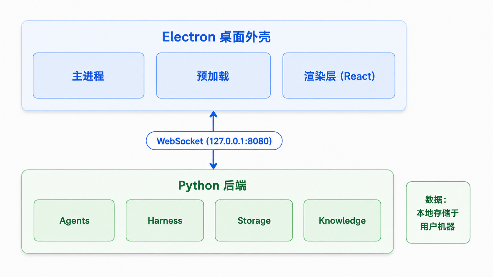
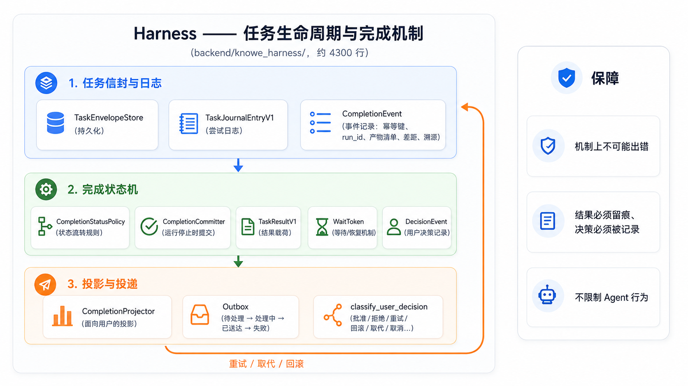

# Knowe — 技术概览

面向想运行、构建或扩展 Knowe 的开发者的快速技术指南。完整用户手册见 [docs 中文](./docs/CN/00-概述.md)（English: [docs/EN](./docs/EN/00-Overview.md)）。

---

## 架构一览



- **前端**：Electron + React 18 + TypeScript，electron-vite 构建
- **后端**：Python 3.11（异步服务），PyInstaller 打包
- **通信**：本机 WebSocket（127.0.0.1:8080）+ 健康检查（127.0.0.1:8081）
- **数据**：全部本地存储——见下文「数据与隐私」

## Harness：任务生命周期与完成机制

Harness（`backend/knowe_harness/`，约 4300 行）是掌管每个任务完整生命周期的机制层——从任务信封与日志，经过完成状态机，到面向用户的投影与 outbox 投递。它保证机制上不可能出错：结果必须留痕、决策必须被记录——同时不限制 Agent 的行为。



## 仓库结构

| 路径 | 说明 |
|---|---|
| `electron/` | Electron 主进程与预加载（窗口、更新、托盘） |
| `src/` | React 渲染层（UI 组件、状态、i18n） |
| `backend/` | Python 后端（agents、harness、存储、知识库、工具） |
| `backend/tests/` | 后端测试（55+ 测试文件） |
| `docs/` | 完整用户手册（中英双语） |
| `assets/` | 宣传图与演示视频 |
| `scripts/` | 构建/开发辅助脚本 |

## 本地开发

环境要求：Node.js 22.12+、Python 3.11、模型 API Key（如 DeepSeek）。

```bash
# 安装前端依赖
npm ci

# 安装后端依赖
pip install -r backend/requirements.txt

# 开发模式启动（前端 + Electron 外壳）
npm run electron:dev
```

开发模式下后端由 Electron 主进程自动拉起。仅需调试后端时，见 `backend/run_backend.py`。

### 校验 / 检查 / 测试

```bash
npm run typecheck   # TypeScript 类型检查（渲染层 + 主进程）
npm run lint        # ESLint
npm run test        # Vitest（前端）
# 后端测试：在 backend/ 下执行 pytest backend/tests/
```

### 配置

配置通过环境变量读取（见 `backend/config.py`）。常用项：

| 变量 | 作用 |
|---|---|
| `DEEPSEEK_API_KEY` | 模型服务 API Key（也可在应用内设置界面配置） |
| `DEEPSEEK_BASE_URL` | 自定义模型服务地址 |
| `KNOWE_AGENT` | Agent 模式：`fake`（离线，不调 LLM）或 `deepseek` |
| `KNOWE_DATA_DIR` | 覆盖数据目录 |
| `KNOWE_MXC_EXECUTABLE` | 固定版本原生终端沙箱执行器的绝对路径（通常由 Electron 注入） |

支持 `.env` 文件（python-dotenv）——**切勿提交到仓库**。

## 构建 Windows 安装包

完整构建管线：PyInstaller 打包后端 + electron-builder 产出 NSIS 安装包。

```bash
# 1. 构建 Python 后端（PyInstaller）—— 在 backend/ 下执行
python -m PyInstaller --noconfirm --clean KnoweBackend.spec

# 2. 准备浏览器自动化所需的 Chromium
npm run copy:chromium

# 3. 构建完整安装包（electron-vite build + electron-builder NSIS）
npm run dist:win
```

产物输出到 `release/`，命名 `Knowe-Setup-<版本号>.exe`。

> **注意**：修改后端代码后，**必须重新执行第 1 步（PyInstaller）**——electron-builder 只组装前端、不会重编后端。打包后请验证进包的 `KnoweBackend.exe` 时间戳是新生成的。

## 数据与隐私

- 所有数据**本地存储**于安装目录下 `data/`（项目、聊天记录、知识库、Token 账本）
- 聊天记录应用内永不删除
- 文件工具受路径校验约束；模型生成的 Shell/Python 进程运行于 Windows 操作系统沙箱，工作区是唯一可写根目录且默认无网络
- 终端要求 Windows 11 build 26100+ 且原生 MXC 探测成功；系统不支持或隔离失败时直接禁用终端，不回退到宿主 Shell
- MXC 0.7 仍是上游早期预览；随包 AppContainer + Job 隔离会在目标机器做回归验证，但不会被描述成虚拟机级或已独立审计的安全边界
- 界面保存的模型 Key 使用当前 Windows 用户范围的 DPAPI 静态加密，且不会进入终端子进程环境
- 浏览器自动化保留 Chromium 沙箱，只允许公网 HTTP(S)，拒绝本机、局域网、链路本地与保留地址
- 无遥测、无云端存储——一切留在你的机器上

## 常见问题

| 现象 | 可能原因 / 处理 |
|---|---|
| 应用能开但 Agent 不回应 | 模型 API Key 缺失或无效——设置 → 模型中配置 |
| 后端启动失败 | 8080/8081 端口被占用——检查是否有另一个 Knowe 实例在运行 |
| 安装包约 250MB | 正常：内置 Python 运行时 + 浏览器自动化 Chromium |

## License

[MIT](./LICENSE)
